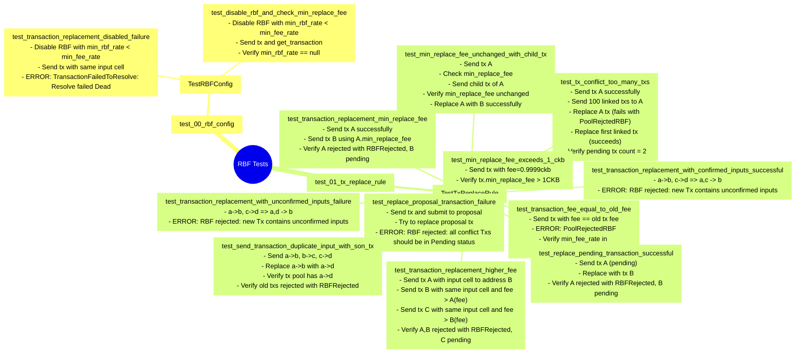

# RBF (Replace-By-Fee) Tests Mind Map

```mermaid
mindmap
  root((RBF Tests))
    test_00_rbf_config[test_00_rbf_config]
      TestRBFConfig[TestRBFConfig]
        test_transaction_replacement_disabled_failure["test_transaction_replacement_disabled_failure
          - Disable RBF with min_rbf_rate < min_fee_rate
          - Send tx with same input cell
          - ERROR: TransactionFailedToResolve: Resolve failed Dead"]
        test_disable_rbf_and_check_min_replace_fee["test_disable_rbf_and_check_min_replace_fee
          - Disable RBF with min_rbf_rate < min_fee_rate
          - Send tx and get_transaction
          - Verify min_rbf_rate == null"]
    test_01_tx_replace_rule[test_01_tx_replace_rule]
      TestTxReplaceRule[TestTxReplaceRule]
        test_transaction_replacement_with_unconfirmed_inputs_failure["test_transaction_replacement_with_unconfirmed_inputs_failure
          - a->b, c->d => a,d -> b
          - ERROR: RBF rejected: new Tx contains unconfirmed inputs"]
        test_transaction_replacement_with_confirmed_inputs_successful["test_transaction_replacement_with_confirmed_inputs_successful
          - a->b, c->d => a,c -> b
          - ERROR: RBF rejected: new Tx contains unconfirmed inputs"]
        test_transaction_fee_equal_to_old_fee["test_transaction_fee_equal_to_old_fee
          - Send tx with fee == old tx fee
          - ERROR: PoolRejectedRBF
          - Verify min_fee_rate in PoolRejectedRBF"]
        test_transaction_replacement_higher_fee["test_transaction_replacement_higher_fee
          - Send tx A with input cell to address B
          - Send tx B with same input cell and fee > A(fee)
          - Send tx C with same input cell and fee > B(fee)
          - Verify A,B rejected with RBFRejected, C pending"]
        test_transaction_replacement_min_replace_fee["test_transaction_replacement_min_replace_fee
          - Send tx A successfully
          - Send tx B using A.min_replace_fee
          - Verify A rejected with RBFRejected, B pending"]
        test_tx_conflict_too_many_txs["test_tx_conflict_too_many_txs
          - Send tx A successfully
          - Send 100 linked txs to A
          - Replace A tx (fails with PoolRejctedRBF)
          - Replace first linked tx (succeeds)
          - Verify pending tx count = 2"]
        test_replace_pending_transaction_successful["test_replace_pending_transaction_successful
          - Send tx A (pending)
          - Replace with tx B
          - Verify A rejected with RBFRejected, B pending"]
        test_replace_proposal_transaction_failure["test_replace_proposal_transaction_failure
          - Send tx and submit to proposal
          - Try to replace proposal tx
          - ERROR: RBF rejected: all conflict Txs should be in Pending status"]
        test_send_transaction_duplicate_input_with_son_tx["test_send_transaction_duplicate_input_with_son_tx
          - Send a->b, b->c, c->d
          - Replace a->b with a->d
          - Verify tx pool has a->d
          - Verify old txs rejected with RBFRejected"]
        test_min_replace_fee_unchanged_with_child_tx["test_min_replace_fee_unchanged_with_child_tx
          - Send tx A
          - Check min_replace_fee
          - Send child tx of A
          - Verify min_replace_fee unchanged
          - Replace A with B successfully"]
        test_min_replace_fee_exceeds_1_ckb["test_min_replace_fee_exceeds_1_ckb
          - Send tx with fee=0.9999ckb
          - Verify tx.min_replace_fee > 1CKB"]
```